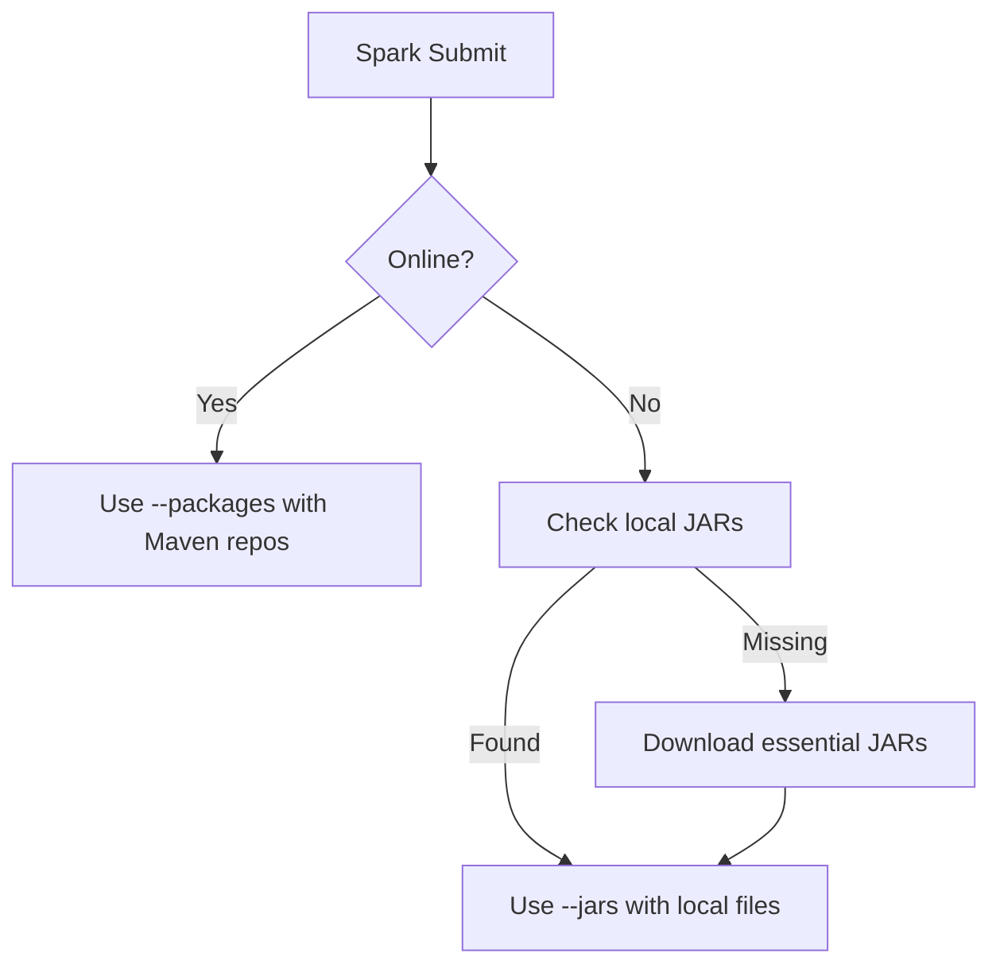

# Enhanced zshrc Configuration

A comprehensive zsh configuration with advanced Spark, Hadoop, and big data development features.

## 🚀 Key Features

### **Core Development Stack**
- **Java 17.0.12-tem** - LTS version optimized for Spark/Hadoop
- **Scala 2.12.18 + 3.3.4** - Dual version setup (Spark compatibility + modern development)
- **Spark 3.5.3** - Pinned stable version with enhanced dependency management  
- **Hadoop 3.3.6** - Integrated with Spark for distributed computing
- **Maven 3.9.6** - Build system with JAR management

### **Smart Auto-Setup System**
- Automatically installs and configures optimal versions
- Online/offline detection with graceful fallbacks
- Background execution to avoid shell startup delays
- Pinned known-good versions to prevent breaking changes

### **Advanced Spark Integration**
- **Intelligent dependency resolution** - Online packages vs local JARs
- **Multiple execution modes** - Local, distributed, Kubernetes, smart detection
- **Sedona 1.7.1** - Modern spatial data processing with latest initialization
- **GraphFrames** - Graph analytics and algorithms
- **API-heavy workload optimization** - Tuned for geocoding, web scraping, etc.

### **Function Backup System**
- Automatic backup of critical functions on startup
- Emergency restore capabilities
- Version-controlled backup history
- Protection against configuration corruption

## 📋 Available Functions

### **Core Spark Functions**
```bash
default_spark_submit <file>         # Local execution with dependency resolution
distributed_spark_submit <file>     # Cluster execution with optimization
smart_spark_submit <file>           # Auto-detect best execution environment
```

### **Cluster Management** 
```bash
spark_start                         # Start local Spark cluster
spark_stop                          # Stop Spark cluster
spark_restart                       # Restart cluster with fresh state
spark_status                        # Check cluster health and status
```

### **Testing & Diagnostics**
```bash
test_spark_comprehensive           # Full Sedona + GraphFrames functionality test
test_spark_dependencies            # Test dependency resolution system
spark_test_simple                  # Quick cluster connectivity test
```

### **Auto-Setup System**
```bash
enable_auto_setup                  # Enable automatic version management
disable_auto_setup                 # Disable auto-setup  
auto_setup_environment             # Run version setup manually
setup_environment_status           # Check current setup status
show_version_strategy              # Display pinned version strategy
verify_version_compatibility       # Check installed version compatibility
```

### **Individual Component Setup**
```bash
setup_java_version                 # Install/configure Java 17
setup_scala_version                # Install dual Scala versions
setup_spark_version                # Install Spark 3.5.3
setup_hadoop_version               # Install Hadoop 3.3.6
setup_maven                        # Install Maven
```

### **Function Backup System**
```bash
backup_critical_functions          # Create backup of important functions
restore_critical_functions         # Restore functions from backup
emergency_restore_test_function    # Emergency inline restore
list_function_backups              # Show available backups
```

### **zshrc Management**
```bash
backup_zshrc                       # Create versioned zshrc backup with git
zshreboot                          # Reload zshrc configuration
zshconfig                          # Open zshrc in editor
```

### **Specialized Workflows**
```bash
heavy_api_submit <file> [mode]     # Optimized for API-heavy workloads
flexible_spark_submit <file> [mode] # Multi-mode execution (local/distributed/k8s/smart)
```

## 🔧 Configuration Variables

### **Auto-Setup Control**
```bash
export AUTO_SETUP_ON_STARTUP="false"    # Enable/disable auto-setup
export AUTO_SETUP_CHECK_ONLINE="true"   # Check connectivity before setup
export AUTO_SETUP_VERBOSE="false"       # Detailed setup output
```

### **Spark Configuration**
```bash
export SPARK_DRIVER_MEMORY="2g"         # Driver memory allocation
export SPARK_EXECUTOR_MEMORY="1g"       # Executor memory allocation
export SPARK_WORKER_MEMORY="2g"         # Worker memory allocation
export SPARK_WORKER_INSTANCES="4"       # Number of worker instances
```

### **Dependency Management**
```bash
export DEFAULT_SPARK_JARS="..."         # Online JAR dependencies
export LOCAL_SPARK_JAR_PATH="$HOME/local_jars"  # Local JAR storage
```

## 🏗️ Architecture

### **Pinned Version Strategy**
This configuration uses a "pinned known-good versions" approach:

- **Java 17.0.12-tem** - Proven LTS version with full Spark/Hadoop support
- **Scala 2.12.18** - Required for Spark 3.5.3 compatibility (default)  
- **Scala 3.3.4** - Available for modern development (`sdk use scala 3.3.4`)
- **Spark 3.5.3** - Your current working version (no surprise upgrades)
- **Hadoop 3.3.6** - Stable integration with Spark ecosystem

### **Dependency Resolution Logic**


### **Smart Environment Detection**
The `smart_spark_submit` function automatically detects:
1. **Kubernetes** - If kubectl available and K8s master configured
2. **Local Cluster** - If Spark master/workers running
3. **Cluster Startup** - Offers to start local cluster if available
4. **Fallback** - Local mode as safe default

## 🧪 Testing Strategy

### **Comprehensive Testing**
The `test_spark_comprehensive` function validates:
- ✅ Core Spark functionality (RDD, DataFrame, SQL)
- ✅ Sedona spatial operations (modern 1.7.1+ initialization)
- ✅ GraphFrames graph analytics
- ✅ Dependency resolution (online/offline modes)
- ✅ Cross-component integration

### **Development Workflow**
```bash
# 1. Check current setup
setup_environment_status

# 2. Run comprehensive test
test_spark_comprehensive

# 3. If issues, verify versions
verify_version_compatibility

# 4. Auto-fix if needed
auto_setup_environment
```

## 🚨 Emergency Procedures

### **If Functions Break**
```bash
# Emergency restore critical functions
emergency_restore_test_function

# Or restore from backup
restore_critical_functions

# Check available backups
list_function_backups
```

### **If zshrc Corrupts**
```bash
# Manual restoration (this README's parent directory)
cp .zshrc_YYYY-MM-DD_HH-MM-SS.txt ~/.zshrc
source ~/.zshrc
```

### **If Spark Breaks**
```bash
# Reset to known-good versions
auto_setup_environment

# Test basic functionality
spark_test_simple

# Full diagnostic
test_spark_comprehensive
```

## 🔄 Maintenance Tasks

### **Regular Updates**
```bash
# Check for component updates (manual)
setup_environment_status

# Update Python packages
pip install --upgrade apache-sedona pyspark

# Backup before major changes
backup_zshrc
backup_critical_functions
```

### **Performance Tuning**
```bash
# For API-heavy workloads
heavy_api_submit your_script.py

# For large datasets
# Edit SPARK_DRIVER_MEMORY and SPARK_EXECUTOR_MEMORY in zshrc
```

## 📊 Compatibility Matrix

| Component | Version | Status | Notes |
|-----------|---------|--------|-------|
| Java      | 17.0.12-tem | ✅ | LTS, Spark/Hadoop compatible |
| Scala     | 2.12.18 | ✅ | Spark 3.5.3 required |
| Scala     | 3.3.4   | ✅ | Modern development |
| Spark     | 3.5.3   | ✅ | Your current stable version |
| Hadoop    | 3.3.6   | ✅ | Integrated with Spark |
| Sedona    | 1.7.1   | ✅ | Latest spatial processing |
| GraphFrames | 0.8.3 | ✅ | Graph analytics |

## 🛠️ Customization

### **Adding New Functions**
1. Add function to zshrc
2. Run `backup_critical_functions` 
3. Test with `zsh -n ~/.zshrc`
4. Reload with `zshreboot`

### **Modifying Versions**
1. Edit target versions in setup functions
2. Run `auto_setup_environment`  
3. Verify with `verify_version_compatibility`

### **Environment-Specific Settings**
```bash
# Add to your zshrc for customization
export SPARK_DRIVER_MEMORY="4g"        # Increase for your workload
export AUTO_SETUP_VERBOSE="true"       # Debug setup issues
export SPARK_WORKER_INSTANCES="8"      # More workers for large datasets
```

## 📝 Changelog

- **v3.0** - Enhanced auto-setup system with pinned versions
- **v2.0** - Function backup system and emergency restore
- **v1.0** - Advanced Spark integration with Sedona + GraphFrames

## 🤝 Contributing

To contribute improvements:
1. `backup_zshrc` before changes
2. Test thoroughly with `test_spark_comprehensive`
3. Update this README
4. Share your enhancements!

---

*Generated for enhanced zshrc configuration with enterprise-grade big data development features.*