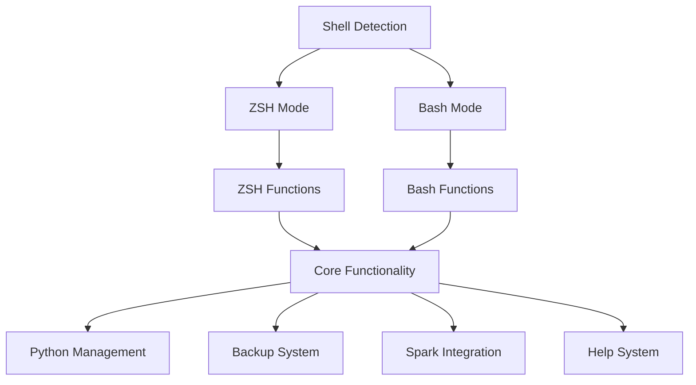

# 🐚 Bash Compatibility System

This guide covers the bash compatibility layer that allows the Siege Analytics ZSH Configuration System to work on bash shells across different platforms.

## Overview

The bash compatibility system provides:

- **Cross-shell functionality** for zsh and bash
- **Platform-specific adaptations** for macOS and Linux
- **Function translation** between zsh and bash syntax
- **Environment variable compatibility**
- **Tool integration** across different shells

## Architecture

### Compatibility Layer



### Shell Detection

Automatic shell detection and adaptation:

```bash
# Shell detection function
detect_shell() {
    if [ -n "$ZSH_VERSION" ]; then
        echo "zsh"
    elif [ -n "$BASH_VERSION" ]; then
        echo "bash"
    else
        echo "unknown"
    fi
}

# Set shell-specific variables
export CURRENT_SHELL=$(detect_shell)
export IS_ZSH=$([ "$CURRENT_SHELL" = "zsh" ] && echo "true" || echo "false")
export IS_BASH=$([ "$CURRENT_SHELL" = "bash" ] && echo "true" || echo "false")
```

## Function Translation

### ZSH to Bash Translation

Translate zsh-specific syntax to bash:

```bash
# ZSH array syntax to bash
# ZSH: array=(item1 item2 item3)
# Bash: array=("item1" "item2" "item3")

# ZSH associative arrays to bash
# ZSH: declare -A array; array[key]=value
# Bash: declare -A array; array[key]=value

# ZSH parameter expansion to bash
# ZSH: ${var:-default}
# Bash: ${var:-default}
```

### Available Functions

The bash compatibility layer provides these functions:

**Core Functions:**
- **Shell Detection**: `detect_shell()`, `detect_platform()`
- **Environment Setup**: `init_compatibility()`

**Python Management:**
- `setup_python_manager()` - Setup Python manager (pyenv/uv/auto)
- `setup_pyenv()` - Setup pyenv environment
- `setup_uv()` - Setup uv environment
- `python_status()` - Show Python environment status

**Backup System:**
- `backup()` - Create system backup with metadata

**Spark Integration:**
- `setup_spark()` - Setup Spark environment
- `show_spark_config()` - Display Spark configuration

**Performance Optimization:**
- `deduplicate_path()` - Remove duplicate PATH entries
- `optimize_shell()` - Optimize shell performance

**Help System:**
- `zsh_help()` - Interactive help system with topics

**Testing & Validation:**
- `test_compatibility()` - Test cross-shell compatibility
- `validate_environment()` - Validate system environment

### Common Function Patterns

Functions that work in both shells:

```bash
# Cross-shell function template
cross_shell_function() {
    local shell_type=$(detect_shell)
    
    case "$shell_type" in
        "zsh")
            # ZSH-specific implementation
            local -A zsh_array
            zsh_array[key]="value"
            ;;
        "bash")
            # Bash-specific implementation
            declare -A bash_array
            bash_array[key]="value"
            ;;
    esac
}
```

## Environment Variables

### Cross-Shell Variables

Environment variables that work in both shells:

```bash
# Core configuration (works in both shells)
export ZSHRC_CONFIG_DIR="$HOME/.config/zsh"
export ZSHRC_BACKUPS="$HOME/.zshrc_backups"
export PYTHON_MANAGER="auto"
export PATH_DEDUPLICATION_ENABLED="true"

# SDKMAN configuration (works in both shells)
export SDKMAN_DIR="$HOME/.sdkman"
export JAVA_HOME="$HOME/.sdkman/candidates/java/current"
export SPARK_HOME="$HOME/.sdkman/candidates/spark/current"
export HADOOP_HOME="$HOME/.sdkman/candidates/hadoop/current"
```

### Shell-Specific Variables

Variables that need shell-specific handling:

```bash
# ZSH-specific variables
if [ "$IS_ZSH" = "true" ]; then
    export ZSH_VERSION
    export ZSH_THEME="powerlevel10k/powerlevel10k"
fi

# Bash-specific variables
if [ "$IS_BASH" = "true" ]; then
    export BASH_VERSION
    export PS1="\\u@\\h:\\w\\$ "
fi
```

## Platform Compatibility

### macOS Compatibility

macOS-specific adaptations:

```bash
# macOS detection
if [[ "$OSTYPE" == "darwin"* ]]; then
    export PLATFORM="macos"
    
    # macOS-specific paths
    export BREW_PREFIX="/opt/homebrew"  # Apple Silicon
    if [ ! -d "$BREW_PREFIX" ]; then
        export BREW_PREFIX="/usr/local"  # Intel
    fi
    
    # macOS-specific tools
    export PATH="$BREW_PREFIX/bin:$PATH"
fi
```

### Linux Compatibility

Linux-specific adaptations:

```bash
# Linux detection
if [[ "$OSTYPE" == "linux-gnu"* ]]; then
    export PLATFORM="linux"
    
    # Detect Linux distribution
    if [ -f /etc/os-release ]; then
        . /etc/os-release
        export LINUX_DISTRO="$ID"
        export LINUX_VERSION="$VERSION_ID"
    fi
    
    # Distribution-specific paths
    case "$LINUX_DISTRO" in
        "ubuntu"|"debian")
            export PACKAGE_MANAGER="apt"
            ;;
        "rhel"|"centos"|"rocky"|"almalinux")
            export PACKAGE_MANAGER="dnf"
            ;;
    esac
fi
```

## Core Function Compatibility

### Python Management

Cross-shell Python management:

```bash
# Python manager detection (works in both shells)
setup_python_manager() {
    local manager=${1:-$PYTHON_MANAGER}
    
    case "$manager" in
        "pyenv")
            setup_pyenv
            ;;
        "uv")
            setup_uv
            ;;
        "auto")
            if [ -f ".python-version" ]; then
                setup_pyenv
            elif [ -f "pyproject.toml" ]; then
                setup_uv
            else
                setup_pyenv  # Default
            fi
            ;;
    esac
}

# Cross-shell pyenv setup
setup_pyenv() {
    export PYENV_ROOT="$HOME/.pyenv"
    export PATH="$PYENV_ROOT/bin:$PATH"
    
    if command -v pyenv >/dev/null 2>&1; then
        eval "$(pyenv init -)"
        if command -v pyenv-virtualenv >/dev/null 2>&1; then
            eval "$(pyenv virtualenv-init -)"
        fi
    fi
}
```

### Backup System

Cross-shell backup functionality:

```bash
# Cross-shell backup function
backup() {
    local message="$1"
    local timestamp=$(date +"%Y-%m-%d_%H-%M-%S")
    local backup_dir="$ZSHRC_BACKUPS/$(date +%Y)/$(date +%m)/week$(date +%V)/config_$timestamp"
    
    # Create backup directory
    mkdir -p "$backup_dir"
    
    # Backup configuration
    cp -r "$ZSHRC_CONFIG_DIR" "$backup_dir/zsh"
    
    # Create metadata
    cat > "$backup_dir/metadata.json" << EOF
{
    "timestamp": "$timestamp",
    "message": "$message",
    "shell": "$CURRENT_SHELL",
    "platform": "$PLATFORM",
    "version": "2.1.0"
}
EOF
    
    echo "Backup created: $backup_dir"
}
```

### Spark Integration

Cross-shell Spark integration:

```bash
# Cross-shell Spark setup
setup_spark() {
    export SPARK_HOME="$HOME/.sdkman/candidates/spark/current"
    export PATH="$SPARK_HOME/bin:$PATH"
    
    # Set Spark Python paths
    if [ "$IS_ZSH" = "true" ]; then
        export PYSPARK_PYTHON=$(pyenv which python 2>/dev/null || which python3)
    else
        export PYSPARK_PYTHON=$(pyenv which python 2>/dev/null || which python3)
    fi
    export PYSPARK_DRIVER_PYTHON=$PYSPARK_PYTHON
}
```

## Installation Scripts

### Bash Installation Script

Create a bash-compatible installation script:

```bash
#!/bin/bash
# install-bash-compatibility.sh

set -e

echo "Installing Siege Analytics Configuration for Bash"

# Detect platform
if [[ "$OSTYPE" == "darwin"* ]]; then
    PLATFORM="macos"
elif [[ "$OSTYPE" == "linux-gnu"* ]]; then
    PLATFORM="linux"
else
    echo "Unsupported platform: $OSTYPE"
    exit 1
fi

# Install SDKMAN
if [ ! -d "$HOME/.sdkman" ]; then
    curl -s "https://get.sdkman.io" | bash
fi

# Source SDKMAN
source "$HOME/.sdkman/bin/sdkman-init.sh"

# Install tools
sdk install java 17.0.9-tem
sdk install scala 2.12.18
sdk install spark 3.5.3
sdk install hadoop 3.3.6

# Clone configuration
cd ~/.config
git clone https://github.com/dheerajchand/siege_analytics_zshrc.git zsh

# Create bash compatibility
cat > ~/.bashrc_siege << 'EOF'
# Siege Analytics Configuration for Bash
export ZSHRC_CONFIG_DIR="$HOME/.config/zsh"
source "$ZSHRC_CONFIG_DIR/bash-compatibility.zsh"
EOF

# Add to existing .bashrc
echo "source ~/.bashrc_siege" >> ~/.bashrc

echo "Installation complete. Restart your shell or run: source ~/.bashrc"
```

### ZSH Installation Script

Create a zsh-compatible installation script:

```bash
#!/bin/zsh
# install-zsh-compatibility.sh

set -e

echo "Installing Siege Analytics Configuration for ZSH"

# Detect platform
if [[ "$OSTYPE" == "darwin"* ]]; then
    PLATFORM="macos"
elif [[ "$OSTYPE" == "linux-gnu"* ]]; then
    PLATFORM="linux"
else
    echo "Unsupported platform: $OSTYPE"
    exit 1
fi

# Install SDKMAN
if [ ! -d "$HOME/.sdkman" ]; then
    curl -s "https://get.sdkman.io" | bash
fi

# Source SDKMAN
source "$HOME/.sdkman/bin/sdkman-init.sh"

# Install tools
sdk install java 17.0.9-tem
sdk install scala 2.12.18
sdk install spark 3.5.3
sdk install hadoop 3.3.6

# Clone configuration
cd ~/.config
git clone https://github.com/dheerajchand/siege_analytics_zshrc.git zsh

# Create zsh symlink
ln -sf ~/.config/zsh/zshrc ~/.zshrc

echo "Installation complete. Restart your shell or run: exec zsh"
```

## Testing and Validation

### Cross-Shell Testing

Test functions in both shells:

```bash
# Test script for both shells
test_compatibility() {
    echo "Testing shell compatibility..."
    echo "Current shell: $CURRENT_SHELL"
    echo "Platform: $PLATFORM"
    
    # Test Python management
    setup_python_manager auto
    python_status
    
    # Test backup system
    backup "Compatibility test"
    
    # Test Spark integration
    setup_spark
    show_spark_config
    
    echo "Compatibility test complete"
}
```

### Validation Scripts

Create validation scripts:

```bash
#!/bin/bash
# validate-bash-compatibility.sh

echo "Validating Bash Compatibility"

# Test basic functions
test_compatibility

# Test environment variables
echo "ZSHRC_CONFIG_DIR: $ZSHRC_CONFIG_DIR"
echo "PYTHON_MANAGER: $PYTHON_MANAGER"
echo "SPARK_HOME: $SPARK_HOME"

# Test tool availability
command -v java >/dev/null && echo "Java: OK" || echo "Java: MISSING"
command -v spark-shell >/dev/null && echo "Spark: OK" || echo "Spark: MISSING"
command -v pyenv >/dev/null && echo "Pyenv: OK" || echo "Pyenv: MISSING"

echo "Validation complete"
```

## Troubleshooting

### Common Issues

#### Shell Detection Issues

```bash
# Debug shell detection
echo "ZSH_VERSION: $ZSH_VERSION"
echo "BASH_VERSION: $BASH_VERSION"
echo "CURRENT_SHELL: $CURRENT_SHELL"

# Manual shell detection
if [ -n "$ZSH_VERSION" ]; then
    echo "Running in ZSH"
elif [ -n "$BASH_VERSION" ]; then
    echo "Running in Bash"
else
    echo "Unknown shell"
fi
```

#### Function Translation Issues

```bash
# Test function compatibility
test_function() {
    local shell_type=$(detect_shell)
    echo "Function running in: $shell_type"
}

# Test array handling
test_arrays() {
    if [ "$IS_ZSH" = "true" ]; then
        local -A test_array
        test_array[key]="value"
        echo "ZSH array: ${test_array[key]}"
    else
        declare -A test_array
        test_array[key]="value"
        echo "Bash array: ${test_array[key]}"
    fi
}
```

#### Platform Detection Issues

```bash
# Debug platform detection
echo "OSTYPE: $OSTYPE"
echo "PLATFORM: $PLATFORM"

# Manual platform detection
if [[ "$OSTYPE" == "darwin"* ]]; then
    echo "macOS detected"
elif [[ "$OSTYPE" == "linux-gnu"* ]]; then
    echo "Linux detected"
else
    echo "Unknown platform"
fi
```

## Best Practices

### Development Guidelines

1. **Use cross-shell compatible syntax** whenever possible
2. **Test functions in both shells** before deployment
3. **Use shell detection** for shell-specific features
4. **Document shell-specific behavior** clearly
5. **Provide fallbacks** for unsupported features

### Deployment Guidelines

1. **Create separate installation scripts** for each shell
2. **Test on multiple platforms** (macOS, Ubuntu, RedHat)
3. **Provide clear documentation** for each shell
4. **Include validation scripts** for testing
5. **Maintain backward compatibility** when possible

### Maintenance Guidelines

1. **Regular testing** of cross-shell compatibility
2. **Update documentation** when adding new features
3. **Monitor for shell-specific issues** in user feedback
4. **Keep installation scripts** up to date
5. **Test with new shell versions** as they're released

> **Note**: The bash compatibility system ensures that the Siege Analytics ZSH Configuration System works seamlessly across different shells and platforms, providing a consistent experience regardless of the user's shell preference.
