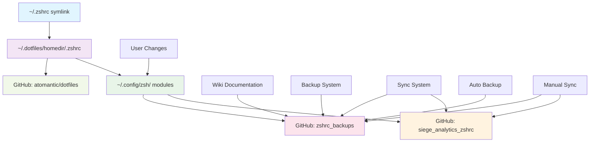

# 💾 Repository Management

Comprehensive documentation of your dual repository system, sync mechanisms, backup strategies, and version control workflows.

## 🎯 **Repository Architecture Overview**

Your zsh configuration system uses a **dual repository architecture** that separates concerns while maintaining synchronization between configuration code and backup snapshots.

## 🔗 **Repository Structure & Relationships**

### **Repository Dependency Graph**



### **Repository Responsibilities Matrix**

| Repository | Purpose | Content | Update Frequency | Owner | Access |
|------------|---------|---------|------------------|-------|---------|
| `atomantic/dotfiles` | Core shell configuration | Basic zsh setup, Oh-My-Zsh | Read-only | External | Public |
| `siege_analytics_zshrc` | Custom modules & functions | Spark, Hadoop, Python, macOS | Continuous | You | Public |
| `zshrc_backups` | Configuration backups | Timestamped config snapshots | On changes | You | Public |
| `zshrc_backups/wiki` | Documentation | Comprehensive guides | As needed | You | Public |

## 🔄 **Dual Repository Sync System**

### **Sync System Architecture**

```
┌─────────────────────────────────────────────────────────────────────────────┐
│                           SYNC SYSTEM ARCHITECTURE                         │
└─────────────────────────────────────────────────────────────────────────────┘
                                    │
                                    ▼
                        ┌─────────────────────┐
                        │  sync_zsh_          │
                        │  repositories()     │
                        └─────────────────────┘
                                    │
                    ┌───────────────┼───────────────┐
                    │               │               │
                    ▼               ▼               ▼
        ┌─────────────────┐ ┌─────────────────┐ ┌─────────────────┐
        │  CONFIG REPO    │ │  BACKUP REPO    │ │  SYNC STATUS    │
        │  SYNC           │ │  SYNC           │ │  REPORTING      │
        │                 │ │                 │ │                 │
        │ 1. git add .    │ │ 1. git add .    │ │ 1. Success     │
        │ 2. git commit   │ │ 2. git commit   │ │    reporting   │
        │ 3. git push     │ │ 3. git push     │ │ 2. Error       │
        │                 │ │                 │ │    handling    │
        │ Dependencies    │ │ Dependencies    │ │ 3. URL         │
        │ - Git          │ │ - Git          │ │    generation   │
        │ - SSH keys     │ │ - SSH keys     │ │                 │
        │ - GitHub API   │ │ - GitHub API   │ │                 │
        └─────────────────┘ └─────────────────┘ └─────────────────┘
                                    │
                                    ▼
                        ┌─────────────────────┐
                        │  SYNC COMPLETION    │
                        │  & REPORTING        │
                        └─────────────────────┘
```

### **Sync Function Specifications**

| Function | Purpose | Parameters | Return Value | Dependencies | Performance |
|----------|---------|------------|--------------|--------------|-------------|
| `sync_zsh_repositories` | Main sync orchestrator | message (opt) | Success/failure | Git, SSH, GitHub API | O(n) |
| `sync_zsh` | Quick sync wrapper | None | Success/failure | Main sync function | O(n) |
| `sync_and_backup` | Sync + backup combo | message (opt) | Success/failure | Sync + backup system | O(n) |
| `zsh_repo_status` | Status reporting | None | Status report | Git status commands | O(1) |

### **Sync Workflow Details**

```bash
# Complete sync workflow
function sync_zsh_repositories {
    local commit_message="${1:-Automatic sync of zsh configuration}"
    local timestamp=$(date +"%Y-%m-%d_%H-%M-%S")
    
    echo "🔄 Syncing zsh configuration repositories..."
    echo "📁 Config repo: $ZSHRC_CONFIG_DIR"
    echo "💾 Backup repo: $ZSHRC_BACKUPS"
    
    # Step 1: Sync config repository
    if [[ -d "$ZSHRC_CONFIG_DIR/.git" ]]; then
        echo "🔄 Syncing config repository..."
        cd "$ZSHRC_CONFIG_DIR"
        
        # Add all changes
        git add .
        
        # Commit if there are changes
        if git diff --staged --quiet; then
            echo "✅ Config repo: No changes to commit"
        else
            if git commit -m "$commit_message ($timestamp)"; then
                echo "✅ Config repo: Changes committed"
                
                # Push to origin
                if git push origin main; then
                    echo "🚀 Config repo: Successfully pushed to GitHub"
                else
                    echo "❌ Config repo: Push failed"
                    return 1
                fi
            else
                echo "❌ Config repo: Commit failed"
                return 1
            fi
        fi
    else
        echo "❌ Config repo: Not a git repository"
        return 1
    fi
    
    # Step 2: Sync backup repository
    if [[ -d "$ZSHRC_BACKUPS/.git" ]]; then
        echo "🔄 Syncing backup repository..."
        cd "$ZSHRC_BACKUPS"
        
        # Add all changes
        git add .
        
        # Commit if there are changes
        if git diff --staged --quiet; then
            echo "✅ Backup repo: No changes to commit"
        else
            if git commit -m "$commit_message - backup sync ($timestamp)"; then
                echo "✅ Backup repo: Changes committed"
                
                # Push to origin
                if git push origin main; then
                    echo "🚀 Backup repo: Successfully pushed to GitHub"
                else
                    echo "❌ Backup repo: Push failed"
                    return 1
                fi
            else
                echo "❌ Backup repo: Commit failed"
                return 1
            fi
        fi
    else
        echo "❌ Backup repo: Not a git repository"
        return 1
    fi
    
    echo "✅ Both repositories synced successfully!"
    echo "📚 Config: https://github.com/dheerajchand/siege_analytics_zshrc"
    echo "💾 Backups: https://github.com/dheerajchand/zshrc_backups"
}
```

## 💾 **Backup System Architecture**

### **Backup System Flow**

```
┌─────────────────────────────────────────────────────────────────────────────┐
│                           BACKUP SYSTEM FLOW                               │
└─────────────────────────────────────────────────────────────────────────────┘
                                    │
                                    ▼
                        ┌─────────────────────┐
                        │  backup_zsh_config  │
                        │  (triggered)        │
                        └─────────────────────┘
                                    │
                    ┌───────────────┼───────────────┼───────────────┐
                    │               │               │               │
                    ▼               ▼               ▼               ▼
        ┌─────────────────┐ ┌─────────────────┐ ┌─────────────────┐ ┌─────────────────┐
        │  CREATE BACKUP  │ │  METADATA       │ │  RESTORE        │ │  GIT            │
        │  DIRECTORY      │ │  GENERATION     │ │  SCRIPT         │ │  INTEGRATION    │
        │                 │ │                 │ │                 │                 │
        │ - Timestamped   │ │ - JSON format   │ │ - Executable    │ │ - Commit        │
        │ - Organized     │ │ - System info   │ │ - Safe restore  │ │ - Push to       │
        │ - Hierarchical  │ │ - User info     │ │ - Validation    │ │   GitHub        │
        │                 │ │ - Config info   │ │                 │ │                 │
        └─────────────────┘ └─────────────────┘ └─────────────────┘ └─────────────────┘
                                    │
                                    ▼
                        ┌─────────────────────┐
                        │  BACKUP COMPLETION  │
                        │  & VERIFICATION     │
                        └─────────────────────┘
```

### **Backup Directory Structure**

```
~/.zshrc_backups/
├── .git/                           # Git repository
├── README.md                       # Repository documentation
├── 2025/                          # Year-based organization
│   ├── 01/                        # Month-based organization
│   │   ├── week1/                 # Week-based organization
│   │   │   └── config_2025-01-01_12-00-00/  # Timestamped backup
│   │   │       ├── zshrc.txt      # Main zshrc backup
│   │   │       ├── zsh/           # Module files backup
│   │   │       │   ├── core.zsh
│   │   │       │   ├── environment.zsh
│   │   │       │   ├── utilities.zsh
│   │   │       │   ├── spark.zsh
│   │   │       │   └── ...
│   │   │       ├── metadata.json  # Backup metadata
│   │   │       └── restore.sh     # Restore script
│   │   ├── week2/
│   │   └── week3/
│   ├── 02/
│   └── 03/
└── zshrc_backup_log.txt           # Backup activity log
```

### **Backup Metadata Schema**

```json
{
    "timestamp": "2025-01-01_12-00-00",
    "commit_message": "Configuration update",
    "backup_type": "modular",
    "system": "Darwin",
    "user": "dheerajchand",
    "hostname": "MacBook-Pro.local",
    "shell_version": "5.9",
    "config_dir": "/Users/dheerajchand/.config/zsh",
    "backup_dir": "/Users/dheerajchand/.zshrc_backups",
    "modules_backed_up": [
        "core.zsh",
        "environment.zsh",
        "utilities.zsh",
        "spark.zsh",
        "hadoop.zsh",
        "docker.zsh",
        "notebooks.zsh",
        "backup-system.zsh",
        "auto-setup.zsh"
    ],
    "file_count": 45,
    "total_size": "2.3MB",
    "git_commit_hash": "a1b2c3d4e5f6",
    "backup_version": "2.1.0"
}
```

### **Backup Function Specifications**

| Function | Purpose | Parameters | Return Value | Dependencies | Performance |
|----------|---------|------------|--------------|--------------|-------------|
| `backup_zsh_config` | Create configuration backup | message (opt) | Success/failure | Git, backup system | O(n) |
| `list_zsh_backups` | List available backups | None | Backup list | File system | O(n) |
| `get_backup_path` | Generate backup path | timestamp | Path string | Date utilities | O(1) |
| `restore_from_backup` | Restore from backup | backup_path | Success/failure | File system | O(n) |

## 🔧 **Repository Management Functions**

### **Status & Monitoring Functions**

```bash
# Repository status monitoring
function zsh_repo_status {
    echo "📊 ZSH Repository Status"
    echo "========================"
    
    # Config repository status
    if [[ -d "$ZSHRC_CONFIG_DIR/.git" ]]; then
        echo "📁 Config Repository ($ZSHRC_CONFIG_DIR):"
        cd "$ZSHRC_CONFIG_DIR"
        echo "   Branch: $(git branch --show-current)"
        echo "   Status: $(git status --porcelain | wc -l | tr -d ' ') files modified"
        echo "   Remote: $(git remote get-url origin)"
        echo "   Ahead: $(git rev-list --count origin/main..HEAD) commits ahead"
        echo "   Behind: $(git rev-list --count HEAD..origin/main) commits behind"
        echo ""
    else
        echo "❌ Config repository not found"
    fi
    
    # Backup repository status
    if [[ -d "$ZSHRC_BACKUPS/.git" ]]; then
        echo "💾 Backup Repository ($ZSHRC_BACKUPS):"
        cd "$ZSHRC_BACKUPS"
        echo "   Branch: $(git branch --show-current)"
        echo "   Status: $(git status --porcelain | wc -l | tr -d ' ') files modified"
        echo "   Remote: $(git remote get-url origin)"
        echo "   Ahead: $(git rev-list --count origin/main..HEAD) commits ahead"
        echo "   Behind: $(git rev-list --count HEAD..origin/main) commits behind"
        echo ""
    else
        echo "❌ Backup repository not found"
    fi
    
    # Return to original directory
    cd "$ZSHRC_CONFIG_DIR"
}

# Repository health check
function check_repository_health {
    echo "🏥 Repository Health Check"
    echo "=========================="
    
    local overall_health="healthy"
    
    # Check config repository
    if [[ -d "$ZSHRC_CONFIG_DIR/.git" ]]; then
        cd "$ZSHRC_CONFIG_DIR"
        
        # Check git status
        if ! git status >/dev/null 2>&1; then
            echo "❌ Config repo: Git repository corrupted"
            overall_health="unhealthy"
        fi
        
        # Check remote connectivity
        if ! git remote get-url origin >/dev/null 2>&1; then
            echo "❌ Config repo: No remote origin configured"
            overall_health="unhealthy"
        fi
        
        # Check for uncommitted changes
        local uncommitted=$(git status --porcelain | wc -l | tr -d ' ')
        if [[ "$uncommitted" -gt 0 ]]; then
            echo "⚠️  Config repo: $uncommitted uncommitted changes"
        fi
        
        echo "✅ Config repo: Git repository healthy"
    else
        echo "❌ Config repo: Not a git repository"
        overall_health="unhealthy"
    fi
    
    # Check backup repository
    if [[ -d "$ZSHRC_BACKUPS/.git" ]]; then
        cd "$ZSHRC_BACKUPS"
        
        # Check git status
        if ! git status >/dev/null 2>&1; then
            echo "❌ Backup repo: Git repository corrupted"
            overall_health="unhealthy"
        fi
        
        # Check remote connectivity
        if ! git remote get-url origin >/dev/null 2>&1; then
            echo "❌ Backup repo: No remote origin configured"
            overall_health="unhealthy"
        fi
        
        # Check backup directory structure
        local backup_count=$(find . -name "config_*" -type d | wc -l | tr -d ' ')
        echo "💾 Backup repo: $backup_count backups available"
        
        echo "✅ Backup repo: Git repository healthy"
    else
        echo "❌ Backup repo: Not a git repository"
        overall_health="unhealthy"
    fi
    
    # Return to original directory
    cd "$ZSHRC_CONFIG_DIR"
    
    echo ""
    echo "🏥 Overall Health: $overall_health"
    
    if [[ "$overall_health" == "unhealthy" ]]; then
        return 1
    else
        return 0
    fi
}
```

### **Maintenance & Cleanup Functions**

```bash
# Repository cleanup and maintenance
function maintain_repositories {
    echo "🧹 Repository Maintenance"
    echo "========================"
    
    # Config repository maintenance
    if [[ -d "$ZSHRC_CONFIG_DIR/.git" ]]; then
        echo "📁 Maintaining config repository..."
        cd "$ZSHRC_CONFIG_DIR"
        
        # Clean untracked files
        git clean -fd
        
        # Prune remote references
        git remote prune origin
        
        # Garbage collection
        git gc --prune=now
        
        echo "✅ Config repository maintained"
    fi
    
    # Backup repository maintenance
    if [[ -d "$ZSHRC_BACKUPS/.git" ]]; then
        echo "💾 Maintaining backup repository..."
        cd "$ZSHRC_BACKUPS"
        
        # Clean untracked files
        git clean -fd
        
        # Prune remote references
        git remote prune origin
        
        # Garbage collection
        git gc --prune=now
        
        echo "✅ Backup repository maintained"
    fi
    
    # Return to original directory
    cd "$ZSHRC_CONFIG_DIR"
    
    echo "🧹 Repository maintenance completed"
}

# Clean old backups
function cleanup_old_backups {
    local days_to_keep="${1:-30}"
    local backup_dir="$ZSHRC_BACKUPS"
    
    echo "🧹 Cleaning up backups older than $days_to_keep days..."
    
    if [[ ! -d "$backup_dir" ]]; then
        echo "❌ Backup directory not found"
        return 1
    fi
    
    # Find old backups
    local old_backups=($(find "$backup_dir" -name "config_*" -type d -mtime +$days_to_keep))
    
    if [[ ${#old_backups[@]} -eq 0 ]]; then
        echo "✅ No old backups to clean up"
        return 0
    fi
    
    echo "🗑️  Found ${#old_backups[@]} old backups to remove:"
    
    for backup in "${old_backups[@]}"; do
        echo "   Removing: $(basename "$backup")"
        rm -rf "$backup"
    done
    
    echo "✅ Cleanup completed"
    
    # Commit cleanup to git
    cd "$backup_dir"
    if git add . && git commit -m "Cleanup: removed backups older than $days_to_keep days"; then
        git push origin main
        echo "🚀 Cleanup committed to git"
    fi
    
    cd "$ZSHRC_CONFIG_DIR"
}
```

## 🔄 **Version Control Workflows**

### **Development Workflow**

```
┌─────────────────────────────────────────────────────────────────────────────┐
│                           DEVELOPMENT WORKFLOW                              │
└─────────────────────────────────────────────────────────────────────────────┘
                                    │
                                    ▼
                        ┌─────────────────────┐
                        │  MAKE CHANGES       │
                        │  (edit files)       │
                        └─────────────────────┘
                                    │
                                    ▼
                        ┌─────────────────────┐
                        │  TEST CHANGES       │
                        │  (function tests)   │
                        └─────────────────────┘
                                    │
                                    ▼
                        ┌─────────────────────┐
                        │  SYNC REPOSITORIES  │
                        │  (commit & push)    │
                        └─────────────────────┘
                                    │
                                    ▼
                        ┌─────────────────────┐
                        │  CREATE BACKUP      │
                        │  (snapshot)         │
                        └─────────────────────┘
                                    │
                                    ▼
                        ┌─────────────────────┐
                        │  VERIFY DEPLOYMENT  │
                        │  (test in production)│
                        └─────────────────────┘
```

### **Backup Workflow**

```
┌─────────────────────────────────────────────────────────────────────────────┐
│                             BACKUP WORKFLOW                                │
└─────────────────────────────────────────────────────────────────────────────┘
                                    │
                                    ▼
                        ┌─────────────────────┐
                        │  TRIGGER BACKUP     │
                        │  (manual/auto)      │
                        └─────────────────────┘
                                    │
                                    ▼
                        ┌─────────────────────┐
                        │  CREATE BACKUP      │
                        │  DIRECTORY          │
                        └─────────────────────┘
                                    │
                                    ▼
                        ┌─────────────────────┐
                        │  COPY FILES         │
                        │  (config + modules) │
                        └─────────────────────┘
                                    │
                                    ▼
                        ┌─────────────────────┐
                        │  GENERATE METADATA  │
                        │  (JSON + scripts)   │
                        └─────────────────────┘
                                    │
                                    ▼
                        ┌─────────────────────┐
                        │  COMMIT TO GIT      │
                        │  (version control)  │
                        └─────────────────────┘
                                    │
                                    ▼
                        ┌─────────────────────┐
                        │  PUSH TO GITHUB     │
                        │  (remote backup)    │
                        └─────────────────────┘
```

## 🚨 **Error Handling & Recovery**

### **Common Error Scenarios**

| Error Type | Cause | Detection | Recovery | Prevention |
|------------|-------|-----------|----------|------------|
| **Git Push Failed** | Network issues, SSH key problems | Push command failure | Retry, check SSH keys | Network monitoring |
| **Repository Corrupted** | File system issues, git corruption | Git status failure | Git repair commands | Regular health checks |
| **Backup Creation Failed** | Disk space, permissions | Backup function failure | Manual backup, cleanup | Disk space monitoring |
| **Sync Failure** | One repo fails | Sync function return code | Manual sync, error analysis | Comprehensive error handling |

### **Recovery Functions**

```bash
# Emergency repository recovery
function emergency_repository_recovery {
    local repo_type="$1"
    
    echo "🚨 Emergency repository recovery for: $repo_type"
    
    case "$repo_type" in
        "config")
            echo "🔄 Recovering config repository..."
            cd "$ZSHRC_CONFIG_DIR"
            
            # Reset to last known good state
            git reset --hard HEAD
            git clean -fd
            
            # Pull latest changes
            git pull origin main
            
            echo "✅ Config repository recovered"
            ;;
        "backup")
            echo "🔄 Recovering backup repository..."
            cd "$ZSHRC_BACKUPS"
            
            # Reset to last known good state
            git reset --hard HEAD
            git clean -fd
            
            # Pull latest changes
            git pull origin main
            
            echo "✅ Backup repository recovered"
            ;;
        "both")
            echo "🔄 Recovering both repositories..."
            emergency_repository_recovery "config"
            emergency_repository_recovery "backup"
            ;;
        *)
            echo "❌ Unknown repository type: $repo_type"
            return 1
            ;;
    esac
    
    # Return to original directory
    cd "$ZSHRC_CONFIG_DIR"
}

# Repository repair
function repair_repository {
    local repo_path="$1"
    
    if [[ ! -d "$repo_path/.git" ]]; then
        echo "❌ Not a git repository: $repo_path"
        return 1
    fi
    
    echo "🔧 Repairing repository: $repo_path"
    cd "$repo_path"
    
    # Check repository integrity
    if ! git fsck --full; then
        echo "❌ Repository integrity check failed"
        return 1
    fi
    
    # Re-index repository
    git reflog expire --expire=now --all
    git gc --prune=now --aggressive
    
    # Verify repair
    if git status >/dev/null 2>&1; then
        echo "✅ Repository repaired successfully"
        return 0
    else
        echo "❌ Repository repair failed"
        return 1
    fi
}
```

## 📊 **Monitoring & Analytics**

### **Repository Metrics**

```bash
# Repository analytics
function repository_analytics {
    echo "📊 Repository Analytics"
    echo "======================="
    
    # Config repository metrics
    if [[ -d "$ZSHRC_CONFIG_DIR/.git" ]]; then
        echo "📁 Config Repository Metrics:"
        cd "$ZSHRC_CONFIG_DIR"
        
        local total_commits=$(git rev-list --count HEAD)
        local total_files=$(git ls-files | wc -l | tr -d ' ')
        local last_commit=$(git log -1 --format="%cd" --date=short)
        local contributors=$(git shortlog -sn | wc -l | tr -d ' ')
        
        echo "   Total commits: $total_commits"
        echo "   Total files: $total_files"
        echo "   Last commit: $last_commit"
        echo "   Contributors: $contributors"
        echo ""
    fi
    
    # Backup repository metrics
    if [[ -d "$ZSHRC_BACKUPS/.git" ]]; then
        echo "💾 Backup Repository Metrics:"
        cd "$ZSHRC_BACKUPS"
        
        local total_backups=$(find . -name "config_*" -type d | wc -l | tr -d ' ')
        local total_size=$(du -sh . | cut -f1)
        local oldest_backup=$(find . -name "config_*" -type d | sort | head -1 | xargs basename)
        local newest_backup=$(find . -name "config_*" -type d | sort | tail -1 | xargs basename)
        
        echo "   Total backups: $total_backups"
        echo "   Total size: $total_size"
        echo "   Oldest backup: $oldest_backup"
        echo "   Newest backup: $newest_backup"
        echo ""
    fi
    
    # Return to original directory
    cd "$ZSHRC_CONFIG_DIR"
}

# Repository performance metrics
function repository_performance_metrics {
    echo "⚡ Repository Performance Metrics"
    echo "================================="
    
    # Measure sync performance
    local start_time=$(date +%s.%N)
    sync_zsh_repositories "Performance test" >/dev/null 2>&1
    local end_time=$(date +%s.%N)
    local sync_duration=$(echo "$end_time - $start_time" | bc -l)
    
    echo "🔄 Sync Performance:"
    echo "   Duration: ${sync_duration}s"
    echo "   Status: $([[ $? -eq 0 ]] && echo "✅ Success" || echo "❌ Failed")"
    echo ""
    
    # Measure backup performance
    start_time=$(date +%s.%N)
    backup_zsh_config "Performance test" >/dev/null 2>&1
    end_time=$(date +%s.%N)
    local backup_duration=$(echo "$end_time - $start_time" | bc -l)
    
    echo "💾 Backup Performance:"
    echo "   Duration: ${backup_duration}s"
    echo "   Status: $([[ $? -eq 0 ]] && echo "✅ Success" || echo "❌ Failed")"
    echo ""
    
    # Overall performance rating
    local overall_rating=""
    if [[ $(echo "$sync_duration < 5 && $backup_duration < 10" | bc -l) -eq 1 ]]; then
        overall_rating="🚀 Excellent"
    elif [[ $(echo "$sync_duration < 10 && $backup_duration < 20" | bc -l) -eq 1 ]]; then
        overall_rating="✅ Good"
    elif [[ $(echo "$sync_duration < 20 && $backup_duration < 30" | bc -l) -eq 1 ]]; then
        overall_rating="⚠️  Fair"
    else
        overall_rating="❌ Poor"
    fi
    
    echo "📊 Overall Performance Rating: $overall_rating"
}
```

## 🔮 **Future Enhancements**

### **Planned Repository Features**

| Feature | Timeline | Description | Impact |
|---------|----------|-------------|---------|
| **Automated Sync** | Q2 2025 | Cron-based automatic syncing | Reduced manual intervention |
| **Conflict Resolution** | Q3 2025 | Smart merge conflict handling | Improved collaboration |
| **Backup Compression** | Q4 2025 | LZ4 compression for backups | Reduced storage usage |
| **Cloud Sync** | Q1 2026 | Multi-device synchronization | Enhanced accessibility |
| **API Integration** | Q2 2026 | GitHub API for advanced operations | Better automation |

### **Repository Evolution Roadmap**

```
┌─────────────────────────────────────────────────────────────────────────────┐
│                           REPOSITORY EVOLUTION                             │
└─────────────────────────────────────────────────────────────────────────────┘
                                    │
                                    ▼
                        ┌─────────────────────┐
                        │  PHASE 1: CURRENT   │
                        │  - Dual repos      │
                        │  - Manual sync      │
                        │  - Basic backup     │
                        └─────────────────────┘
                                    │
                                    ▼
                        ┌─────────────────────┐
                        │  PHASE 2: AUTOMATED │
                        │  - Auto sync        │
                        │  - Smart backup     │
                        │  - Health monitoring│
                        └─────────────────────┘
                                    │
                                    ▼
                        ┌─────────────────────┐
                        │  PHASE 3: INTELLIGENT│
                        │  - Conflict resolution│
                        │  - Predictive backup │
                        │  - Performance opt   │
                        └─────────────────────┘
                                    │
                                    ▼
                        ┌─────────────────────┐
                        │  PHASE 4: ENTERPRISE │
                        │  - Multi-device     │
                        │  - Team collaboration│
                        │  - Advanced analytics│
                        └─────────────────────┘
```

---

**Comprehensive repository management with dual repository architecture, intelligent sync, and robust backup systems!** 🚀

**Next**: Read about [macOS Integration](macOS-Integration) or [Testing & Validation](Testing-Validation) features.
